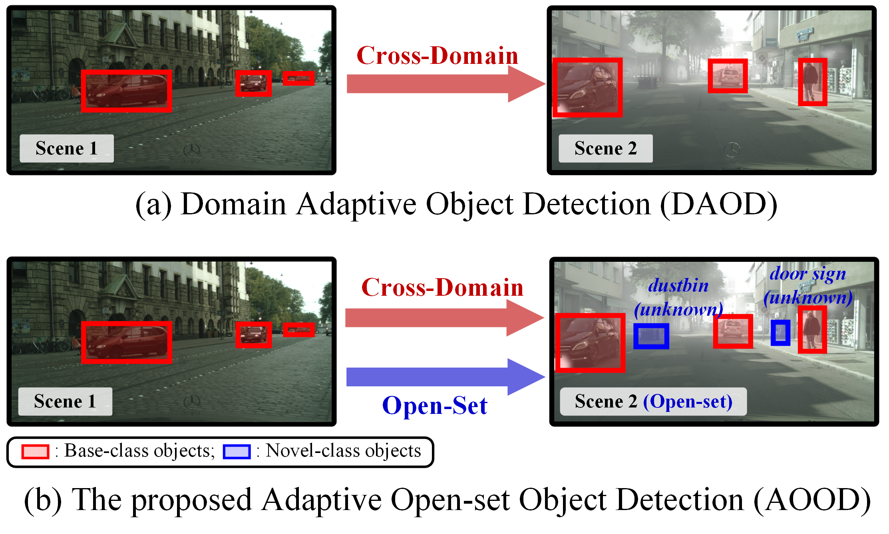
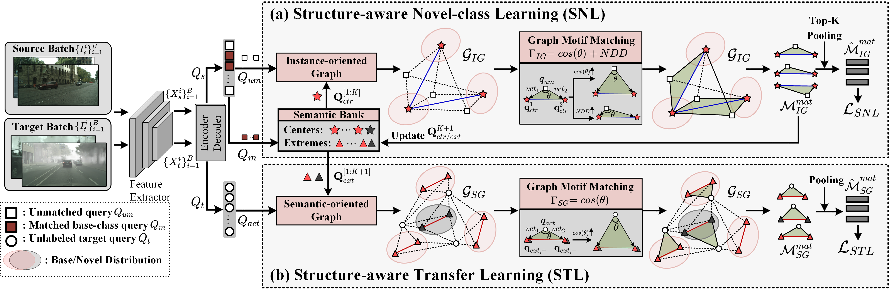

## [Novel Scenes &amp; Classes: Towards Adaptive Open-set Object Detection (ICCV-23 ORAL)](https://openaccess.thecvf.com/content/ICCV2023/papers/Li_Novel_Scenes__Classes_Towards_Adaptive_Open-set_Object_Detection_ICCV_2023_paper.pdf)

By [Wuyang Li](https://wymancv.github.io/wuyang.github.io/)

<div align=center>

</div>

Domain Adaptive Object Detection (DAOD) strongly assumes a shared class space between the two domains.

This work breaks the assumption and formulates Adaptive Open-set Object Detection (AOOD), by allowing the target domain with novel-class objects.

The object detector uses the base-class labels in the source domain for training, and aims to detect base-class objects and identify novel-class objects as unknown in the target domain.

If you have any ideas and problems hope to discuss, you can reach me out via  [E-mail](mailto:wuyangli2-c@my.cityu.edu.hk).

## 💡 Preparation

### Step 1: Clone and Install the Project

#### (a) Clone the repository

```bash
git clone https://github.com/CityU-AIM-Group/SOMA.git
```

#### (b) Install the project following [Deformable DETR](https://github.com/fundamentalvision/Deformable-DETR)

Note that the following is in line with our experimental environments, which is silightly different from the official one.

```
# Linux, CUDA>=9.2, GCC>=5.4
# (ours) CUDA=10.2, GCC=8.4, NVIDIA V100 
# Establish the conda environment

conda create -n aood python=3.7 pip
conda activate aood
conda install pytorch=1.5.1 torchvision=0.6.1 cudatoolkit=10.2 -c pytorch
pip install -r requirements.txt

# Compile the project
cd ./models/ops
sh ./make.sh

# unit test (should see all checking is True)
python test.py

# NOTE: If you meet the permission denied issue when starting the training
cd ../../ 
chmod -R 777 ./
```

### Step 2: Download Necessary Resources

#### (a) Download pre-processed datasets (VOC format) from the following links

|                |                                                              (Foggy) Cityscapes                                                              |                              Pascal VOC                              |                                                                      Clipart                                                                      |                                                                      BDD100K                                                                      |
| :------------: | :------------------------------------------------------------------------------------------------------------------------------------------: | :------------------------------------------------------------------: | :-----------------------------------------------------------------------------------------------------------------------------------------------: | :-----------------------------------------------------------------------------------------------------------------------------------------------: |
| Official Links |                                                [Imgs](https://www.cityscapes-dataset.com/login/)                                                | [Imgs+Labels](https://pjreddie.com/projects/pascal-voc-dataset-mirror/) |                                                                         -                                                                         |                                                                         -                                                                         |
|   Our Links   | [Labels](https://portland-my.sharepoint.com/:u:/g/personal/wuyangli2-c_my_cityu_edu_hk/EVNAjK2JkG9ChREzzqdqJkYBLoZ_VOqkMdhWasN_BETGWw?e=fP9Ae4) |                                  -                                  | [Imgs+Labels](https://portland-my.sharepoint.com/:u:/g/personal/wuyangli2-c_my_cityu_edu_hk/Edz2YcXHuStIqwM_NA7k8FMBGLeyAGQcSjdSR-vYaVx_vw?e=es6KDW) | [Imgs+Labels](https://portland-my.sharepoint.com/:u:/g/personal/wuyangli2-c_my_cityu_edu_hk/EeiO6O36QgZKnTcUZMInACIB0dfWEg4OFyoEZnZCkibKHA?e=6byqBX) |

#### (b) Download DINO-pretrained ResNet-50 from this [link](https://portland-my.sharepoint.com/:u:/g/personal/wuyangli2-c_my_cityu_edu_hk/EVnK9IPi91ZPuNmwpeSWGHABqhSFQK52I7xGzroXKeuyzA?e=EnlwgO)

### Step 3: Change the Path

#### (a) Change the data path as follows.

```
[DATASET_PATH]
└─ Cityscapes
   └─ AOOD_Annotations
   └─ AOOD_Main
      └─ train_source.txt
      └─ train_target.txt
      └─ val_source.txt
      └─ val_target.txt
   └─ leftImg8bit
      └─ train
      └─ val
   └─ leftImg8bit_foggy
      └─ train
      └─ val
└─ bdd_daytime
   └─ Annotations
   └─ ImageSets
   └─ JPEGImages
└─ clipart
   └─ Annotations
   └─ ImageSets
   └─ JPEGImages
└─ VOCdevkit
   └─ VOC2007
   └─ VOC2012
```

#### (b) Change the data root in the config files

Replace the DATASET.COCO_PATH in all yaml files in [config](configs) by your data root $DATASET_PATH, e.g., https://github.com/CityU-AIM-Group/SOMA/blob/41c11cbcb3589376f956950209d5ae3fbc839792/configs/soma_aood_city_to_foggy_r50.yaml#L22

#### (c) Change the path of DINO-pretrained backbone

Replace the backbone loading path:
https://github.com/CityU-AIM-Group/SOMA/blob/41c11cbcb3589376f956950209d5ae3fbc839792/models/backbone.py#L107

## 🔥 Start Training

We use two GPUs for training with 2 source images and 2 target images as input.

```bash
GPUS_PER_NODE=2 
./tools/run_dist_launch.sh 2 python main.py --config_file {CONFIG_FILE} --opts DATASET.AOOD_SETTING 1
```

We provide some scripts in our experiments in [run.sh](./run.sh). After "--opts", the settings will overwrite the default config file as the maskrcnn-benchmark framework.

## 📦 Well-trained models

Will be provided later

<!-- | Source| Target| Task | mAP $_b$ | AR $_n$ |  WI	 | AOSE |  AP@75 |	 checkpoint |
| :-----:| :-----:| :-----:| :-----:| :-----:| :-----:| :-----:| :-----:| :-----:
| City 	|Foggy 	| het-sem | 
| City 	|Foggy 	| het-sem | 
| City 	|Foggy 	| het-sem | 
| City 	|Foggy 	| het-sem |  -->


## 💬 Notification

- The core idea is to select informative motifs (which can be treated as the mix-up of object queries) for self-training.
- You can try the DA version of [OW-DETR](https://github.com/akshitac8/OW-DETR) in this repository by setting: 
```
-opts AOOD.OW_DETR_ON True
```
- Adopting SAM to address AOOD may be a good direction.
- To visualize unknown boxes, post-processing is needed in [PostProcess](models/motif_detr.py).

## 📝 Citation

If you think this work is helpful for your project, please give it a star and citation. We sincerely appreciate your acknowledgment.

```BibTeX
@InProceedings{Li_2023_ICCV,
    author    = {Li, Wuyang and Guo, Xiaoqing and Yuan, Yixuan},
    title     = {Novel Scenes \& Classes: Towards Adaptive Open-set Object Detection},
    booktitle = {ICCV},
    year      = {2023},
}
```

Relevant project:

Exploring a similar task for the image classification. [[link]](https://openaccess.thecvf.com/content/CVPR2023/html/Li_Adjustment_and_Alignment_for_Unbiased_Open_Set_Domain_Adaptation_CVPR_2023_paper.html)

```BibTeX
@InProceedings{Li_2023_CVPR,
    author    = {Li, Wuyang and Liu, Jie and Han, Bo and Yuan, Yixuan},
    title     = {Adjustment and Alignment for Unbiased Open Set Domain Adaptation},
    booktitle = {CVPR},
    year      = {2023},
}
```

## 🤞 Acknowledgements

We greatly appreciate the tremendous effort for the following works.

- This work is based on the DAOD framework [AQT](https://github.com/weii41392/AQT).
- Our work is highly inspired by [OW-DETR](https://github.com/akshitac8/OW-DETR) and [OpenDet](https://github.com/csuhan/opendet2).
- The implementation of the basic detector is based on [Deformable DETR](https://github.com/fundamentalvision/Deformable-DETR).

## 📒 Abstract

Domain Adaptive Object Detection (DAOD) transfers an object detector to a novel domain free of labels. However, in the real world, besides encountering novel scenes, novel domains always contain novel-class objects de facto, which are ignored in existing research. Thus, we formulate and study a more practical setting, Adaptive Open-set Object Detection (AOOD), considering both novel scenes and classes. Directly combing off-the-shelled cross-domain and open-set approaches is sub-optimal since their low-order dependence, such as the confidence score, is insufficient for the AOOD with two dimensions of novel information. To address this, we propose a novel Structured Motif Matching (SOMA) framework for AOOD, which models the high-order relation with motifs, i.e., statistically significant subgraphs, and formulates AOOD solution as motif matching to learn with high-order patterns. In a nutshell, SOMA consists of Structure-aware Novel-class Learning (SNL) and Structure-aware Transfer Learning (STL). As for SNL, we establish an instance-oriented graph to capture the class-independent object feature hidden in different base classes. Then, a high-order metric is proposed to match the most significant motif as high-order patterns, serving for motif-guided novel-class learning. In STL, we set up a semantic-oriented graph to model the class-dependent relation across domains, and match unlabelled objects with high-order motifs to align the cross-domain distribution with structural awareness. Extensive experiments demonstrate that the proposed SOMA achieves state-of-the-art performance.


